---
hide:
  - title
---

<style>
  .md-content h1 { display: none !important; }
</style>

<div class="hero-sov" markdown="1">

<span class="sovereignty-badge">Enclave Local · Soberanía Digital</span>


<p class="hero-subtitle">
La plataforma de <strong>Soberanía Cognitiva</strong> que transforma datos brutos en capital cognitivo estructurado, operando bajo el control absoluto de tu infraestructura.
</p>

<div class="hero-cta">
  <a href="portal/quickstart/" class="btn-primary">Comenzar Desafío</a>
  <a href="installation/" class="btn-secondary">Arquitectura Técnica</a>
</div>

</div>


<div class="mantra-manifesto" markdown="1">
"No venimos solo a construir software. Entrenamos criterio humano para cooperar con sistemas inteligentes."
</div>

## Gobernanza Cognitiva Soberana

<div class="tactical-container" markdown="1">

### Flujo del Capital Cognitivo
A diferencia de los sistemas tradicionales, Atlantyqa asegura que el ciclo de vida del dato se mantenga dentro de tu dominio soberano.

```mermaid
graph TD
    Input[Datos Heterogéneos] --> Ingestor[Ingesta Multimodal]
    Ingestor --> Enclave[Enclave Local Soberano]
    Enclave --> Analyze[Cerebro Cognitivo]
    Analyze --> Insights[Capital Cognitivo Estructurado]
    Insights --> GitOps[Gobernanza GitOps]

    style Input fill:#f8f9fa,stroke:#cbd5e0,stroke-width:1px,color:#182232
    style Ingestor fill:#f8f9fa,stroke:#cbd5e0,stroke-width:1px,color:#182232
    style Enclave fill:#eef9f5,stroke:#37a880,stroke-width:2px,color:#182232
    style Analyze fill:#fdf8ef,stroke:#e7ae4c,stroke-width:2px,color:#182232
    style Insights fill:#f8f9fa,stroke:#cbd5e0,stroke-width:1px,color:#182232
    style GitOps fill:#f8f9fa,stroke:#cbd5e0,stroke-width:1px,color:#182232
```



</div>

## Pilares del Ecosistema

<div class="features-grid" markdown="1">

<div class="feature-card" markdown="1">
<div class="feature-icon">
  <svg xmlns="http://www.w3.org/2000/svg" viewBox="0 0 24 24"><path d="M12 2C6.48 2 2 6.48 2 12s4.48 10 10 10 10-4.48 10-10S17.52 2 12 2zm-1 17.93c-3.95-.49-7-3.85-7-7.93 0-.62.08-1.21.21-1.79L9 15v1c0 1.1.9 2 2 2v1.93zm6.9-2.54c-.26-.81-1-1.39-1.9-1.39h-1v-3c0-.55-.45-1-1-1H8v-2h2c.55 0 1-.45 1-1V7h2c1.1 0 2-.9 2-2v-.41c2.93 1.19 5 4.06 5 7.41 0 2.08-.8 3.97-2.1 5.39z"/></svg>
</div>
<h3 class="feature-title">Soberanía Local-First</h3>
<p class="feature-description">
Ejecución en enclave local privado. Tus datos nunca abandonan tu máquina, garantizando cumplimiento normativo extremo (GDPR/EUAI Act).
</p>
</div>

<div class="feature-card" markdown="1">
<div class="feature-icon">
  <svg xmlns="http://www.w3.org/2000/svg" viewBox="0 0 24 24"><path d="M12 2C6.48 2 2 6.48 2 12s4.48 10 10 10 10-4.48 10-10S17.52 2 12 2zm0 18c-4.41 0-8-3.59-8-8 0-.29.02-.58.05-.86 2.36-1.05 4.23-2.98 5.21-5.37C11.07 8.33 14.05 10 17.42 10c.78 0 1.53-.09 2.25-.26.21.71.33 1.47.33 2.26 0 4.41-3.59 8-8 8z"/></svg>
</div>
<h3 class="feature-title">Análisis Táctico IA</h3>
<p class="feature-description">
Motor semántico avanzado basado en spaCy y Transformers que extrae entidades, riesgos y sentimientos sin dependencias de la nube.
</p>
</div>

<div class="feature-card" markdown="1">
<div class="feature-icon">
  <svg xmlns="http://www.w3.org/2000/svg" viewBox="0 0 24 24"><path d="M21 16.5C21 16.88 20.79 17.21 20.47 17.38L12.57 21.82C12.41 21.94 12.21 22 12 22C11.79 22 11.59 21.94 11.43 21.82L3.53 17.38C3.21 17.21 3 16.88 3 16.5V7.5C3 7.12 3.21 6.79 3.53 6.62L11.43 2.18C11.59 2.06 11.79 2 12 2C12.21 2 12.41 2.06 12.57 2.18L20.47 6.62C20.79 6.79 21 7.12 21 7.5V16.5Z"/></svg>
</div>
<h3 class="feature-title">Trazabilidad GitOps</h3>
<p class="feature-description">
Cada resultado analizado se versiona y sincroniza mediante Git, creando un rastro de auditoría inmutable y colaborativo.
</p>
</div>

</div>

## Modelo Cooperativo

Este proyecto nace bajo un marco de **trabajo cooperativo**. No es simplemente un producto de software; es un recurso compartido para comunidades que buscan independencia tecnológica.

- **Learning by Doing**: Cada contribución es un paso en tu progresión de talento.
- **Capital Compartido**: El conocimiento se estructura y se devuelve al ecosistema ATLANTYDE.
- **Infraestructura Ética**: Diseñado desde el sur de Europa para el empoderamiento ciudadano.

---

<div class="quickstart-section" markdown="1">

### Despliegue Rápido
Inicia tu enclave cognitivo en tres comandos:

```bash
# Sincroniza y prepara
python cogctl.py init

# Ingesta información estratégica
python cogctl.py ingest <mi_archivo.pdf>

# Genera capital cognitivo
python cogctl.py analyze
```

</div>

<div style="text-align: center; margin-top: 3rem; padding: 2rem; background: linear-gradient(135deg, rgba(55, 168, 128, 0.05) 0%, rgba(231, 174, 76, 0.05) 100%); border-radius: 16px; border: 1px solid rgba(255,255,255,0.1);">
<p style="font-size: 1.1rem; font-weight: 600; color: var(--atlantyqa-navy); margin-bottom: 1.5rem;">
¿Preparado para asegurar tu soberanía digital?
</p>
<a href="portal/quickstart/" class="btn-primary" style="display: inline-block;">Iniciar Learning Path →</a>
</div>

---

# ATLANTYQA Cognitive Suite
## Infraestructura cognitiva soberana para entornos regulados

**ATLANTYQA** diseña y despliega **infraestructura cognitiva soberana** que permite a instituciones y organizaciones reguladas adoptar IA y automatización **sin perder control, cumplimiento o confianza**.

Movemos organizaciones **de la regulación a la ejecución**.

---

## Por qué importa ahora

Las instituciones y sectores regulados en Europa enfrentan la misma tensión:

- Presión para adoptar IA y automatización
- Requisitos regulatorios crecientes (GDPR, AI Act, NIS2, CRA, DORA)
- Dependencia de hyperscalers no europeos
- Costes operativos y de cumplimiento en aumento

**La IA sin control aumenta el riesgo sistémico.**
**ATLANTYQA lo reduce —y al mismo tiempo habilita productividad.**

---

## Qué hacemos

ATLANTYQA entrega **infraestructura cognitiva**, no solo software.

Combinamos:

- **IA local, on-premise**
- **Automatización gobernada y agentes AI**
- **Compliance-as-Code con evidencia continua**
- **Operación reproducible y auditable**
- **Desarrollo de talento sobre sistemas reales**

Todo diseñado para **instituciones públicas y sectores regulados**.

---

## Diseñado para restricciones reales

ATLANTYQA está construido para entornos donde:

- Los datos no pueden salir del control institucional
- Las decisiones deben ser trazables y auditables
- La automatización debe seguir siendo responsable
- El cumplimiento debe demostrarse, no declararse

Por eso nuestra arquitectura prioriza:

- Modelos de despliegue locales e híbridos
- Separación clara de responsabilidades
- Gobernanza con humanos en el bucle
- Generación de evidencia desde el primer día

---

## Soluciones por sector

Nuestra infraestructura se adapta a dominios clave:

- **Universidades e instituciones de investigación** — Infraestructura soberana para investigación y docencia, alineada con comités éticos y marcos europeos.
- **Ayuntamientos y territorios ITI** — Infraestructura pública que protege datos ciudadanos, reduce dependencia y crea capacidad técnica local.
- **Banca y finanzas reguladas** — Automatización diseñada para pasar auditorías, reducir exposición regulatoria e integrarse con sistemas core existentes.
- **Salud y hospitales** — Asistencia IA clínica con soberanía total del dato y supervisión humana.

👉 Explora **Soluciones por sector** para ver cómo aplica ATLANTYQA en tu entorno.

---

## Confianza, gobernanza y cumplimiento

La confianza no es una afirmación: es arquitectura.

ATLANTYQA incrusta gobernanza en cada capa:

- Controles de cumplimiento mapeados con regulación europea
- Generación continua de evidencia
- Arquitecturas listas para DPIA
- Flujos de datos seguros y registros
- Modelos de despliegue reproducibles

Nuestra documentación de **Confianza y Gobernanza** es pública por diseño.

---

## Cómo funciona la adopción

No empezamos con grandes disrupciones.

Modelo habitual de compromiso:

1. **Piloto controlado (180 dias)**
2. Evidencia y métricas desde el día uno
3. Escalado gradual según valor probado
4. Operación a largo plazo o transferencia a equipos internos

Así minimizamos riesgos y construimos capacidad duradera.

---

## Construido para builders — Validado por instituciones

ATLANTYQA es:

- Transparente y abierto por diseño
- Construido con prácticas modernas de DevSecOps y GitOps
- Documentado, reproducible y auditable
- Diseñado para integrarse con sistemas existentes

Los desarrolladores pueden empezar de inmediato.
Las instituciones pueden comprometerse con confianza.

---

## Comenzar

- 👉 Explora **Soluciones por sector**
- 👉 Revisa **Confianza y Gobernanza**
- 👉 Arranca con el **Quickstart** (técnico)

📩 **Para pilotos institucionales, RFPs o despliegues regulados**, contáctanos directamente.

---

**ATLANTYQA**
Infraestructura cognitiva soberana para un presente regulado y responsable.
