# 🚀 Bootstrap: Your First Dashboard

!!! quote "Instant Vision"
    You don't need to be a frontend expert. With this bootstrap, you'll raise an operational command center in less than 2 minutes.

---

<div class="tactical-container" style="margin: 4rem 0; padding: 2rem;">
  <h3 style="margin-top: 0; text-align: center; color: var(--atlantyqa-navy);">Dashboard Architecture</h3>


</div>

```mermaid
graph TD
    User[👤 User] -->|Browser| Streamlit[📊 Streamlit UI]
    Streamlit -->|Reads| JSON[📂 Insights JSON]
    Streamlit -->|Verifies| Auth[🔐 Token Auth]

    style User fill:#e7ae4c,stroke:#333,stroke-width:2px,color:#fff
    style Streamlit fill:#37a880,stroke:#333,stroke-width:2px,color:#fff
    style JSON fill:#f1f5f9,stroke:#333,stroke-width:2px,color:#182232
    style Auth fill:#e0e7ff,stroke:#333,stroke-width:2px,color:#182232
```

## 1. ⚡ Launch Sequence

Choose your deployment configuration.

=== "🏎️ Quick Mode (Dev)"
    Perfect for testing visual changes instantly.

    1.  **Run**:
        ```bash
        streamlit run frontend/onboarding_app.py --server.port 8501
        ```
    2.  **Access**: [http://localhost:8501](http://localhost:8501)

=== "🏭 Prod Simulation Mode"
    Test access controls before deploying.

    1.  **Configure Tokens**:
        ```bash
        export COGNITIVE_ENV=prod
        export COGNITIVE_UI_TOKEN_ADMIN=admin123
        export COGNITIVE_HASH_SALT=secret_salt
        ```
    2.  **Launch**:
        ```bash
        streamlit run frontend/streamlit_app.py --server.headless true
        ```

---

## 2. 🧪 Test Data

If your dashboard is empty, feed it.

```bash
# 1. Demo ingestion
python cogctl.py ingest demo_input.json

# 2. Analysis
python cogctl.py analyze
```

Now refresh the browser (F5). You should see charts and tables.

---

## 3. 🛡️ Engineering Best Practices

<div class="features-grid">
    <div class="feature-card">
        <h3>🔐 Secrets Management</h3>
        <p>Never upload your tokens to the repository. Use environment variables (<code>.env</code>) or GitHub Actions secrets.</p>
    </div>
    <div class="feature-card">
        <h3>☁️ Clean Outputs</h3>
        <p>In production, Streamlit should only read from the <code>outputs/insights</code> folder (processed data), never from <code>raw</code>.</p>
    </div>
</div>

---

### Ready for More?

Explore how to secure this flow with **GitOps**.

### 🔭 Related Missions
*   [🟢 Lab 01: Deep Dive](../lab-01-deep-dive/)
*   [🔵 Lab 02: GitOps Steward](../learning-gitops-streamlit/)

<div class="hero-cta" style="justify-content: start;">
  <a href="../learning-gitops-streamlit/" class="btn-primary">Go to GitOps Lab →</a>
</div>
