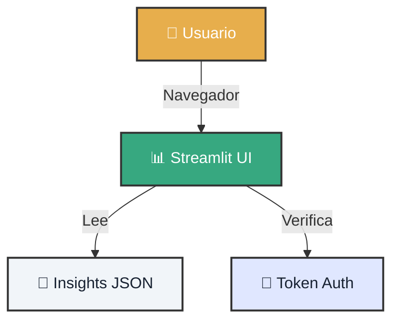

# 🚀 Bootstrap: Tu Primer Dashboard

!!! quote "Visión Instantánea"
    No necesitas ser un experto en frontend. Con este bootstrap, levantarás un centro de mando operativo en menos de 2 minutos.

---

<div class="tactical-container" style="margin: 4rem 0; padding: 2rem;">
  <h3 style="margin-top: 0; text-align: center; color: var(--atlantyqa-navy);">Arquitectura del Dashboard</h3>
  

</div>

## 1. ⚡ Secuencia de Lanzamiento

Elige tu configuración de despliegue.

=== "🏎️ Modo Rápido (Dev)"
    Perfecto para probar cambios visuales al instante.
    
    1.  **Ejecutar**:
        ```bash
        streamlit run frontend/onboarding_app.py --server.port 8501
        ```
    2.  **Acceder**: [http://localhost:8501](http://localhost:8501)

=== "🏭 Modo Simulación Prod"
    Prueba los controles de acceso antes de desplegar.
    
    1.  **Configurar Tokens**:
        ```bash
        export COGNITIVE_ENV=prod
        export COGNITIVE_UI_TOKEN_ADMIN=admin123
        export COGNITIVE_HASH_SALT=salt_secreto
        ```
    2.  **Lanzar**:
        ```bash
        streamlit run frontend/streamlit_app.py --server.headless true
        ```

---

## 2. 🧪 Datos de Prueba

Si tu dashboard está vacío, aliméntalo.

```bash
# 1. Ingesta de demo
python cogctl.py ingest demo_input.json

# 2. Análisis
python cogctl.py analyze
```

Ahora refresca el navegador (F5). Deberías ver gráficos y tablas.

---

## 3. 🛡️ Buenas Prácticas de Ingeniería

<div class="features-grid">
    <div class="feature-card">
        <h3>🔐 Gestión de Secretos</h3>
        <p>Nunca subas tus tokens al repositorio. Usa variables de entorno (<code>.env</code>) o secretos de GitHub Actions.</p>
    </div>
    <div class="feature-card">
        <h3>☁️ Salidas Limpias</h3>
        <p>En producción, Streamlit solo debe leer de la carpeta <code>outputs/insights</code> (datos procesados), nunca de <code>raw</code>.</p>
    </div>
</div>

---

### ¿Listo para más?

Explora cómo asegurar este flujo con **GitOps**.

<div class="hero-cta" style="justify-content: start;">
  <a href="../learning-gitops-streamlit/" class="btn-primary">Ir al Lab de GitOps →</a>
</div>
