# 🔐 Lab 02: GitOps Steward - Secure Synchronization

!!! tip "Mission Scenario"
    You are the **GitOps Steward** of Atlantyqa. You've completed local analyses and now must sync results with the remote repository **without leaking a single sensitive byte**. Your mission: master the secure GitOps flow.

---

## 1. 🗺️ Operations Map

Before syncing, visualize the secure data flow.

```mermaid
graph TD
    Local[💻 Local Analysis] -->|Generates| Raw[📂 Raw JSON]
    Raw -->|Redaction| Safe[🛡️ Secure JSON]
    Safe -->|Git Push| Repo[☁️ Remote Repo]
    Repo -->|Deploy| Prod[🚀 Streamlit Prod]

    style Local fill:#e7ae4c,stroke:#333,stroke-width:2px,color:#fff
    style Raw fill:#f1f5f9,stroke:#333,stroke-width:2px,color:#182232
    style Safe fill:#37a880,stroke:#333,stroke-width:2px,color:#fff
    style Repo fill:#e0e7ff,stroke:#333,stroke-width:2px,color:#182232
    style Prod fill:#f1f5f9,stroke:#182232,stroke-width:2px,color:#182232
```



## 2. ⚔️ Mission Execution

Follow the steps with surgical precision.

=== "Step 1: Local Analysis"
    First, generate local data (you should have this from Lab 01).

    ```bash
    python cogctl.py ingest data/input/sample_contract.pdf
    python cogctl.py analyze
    ```

    **Expected result:** `outputs/raw/analysis.json` created.

=== "Step 2: Activate Production Mode"
    Configure environment variables to activate the privacy shield.

    ```bash
    # In PowerShell
    $env:COGNITIVE_ENV="prod"
    $env:GITOPS_DATA_MODE="redacted"
    $env:COGNITIVE_HASH_SALT="my_secret_salt_123"

    # In Bash
    export COGNITIVE_ENV=prod
    export GITOPS_DATA_MODE=redacted
    export COGNITIVE_HASH_SALT=my_secret_salt_123
    ```

=== "Step 3: Redact Sensitive Data"
    Run the redaction script that masks personal information.

    ```bash
    python pipeline/redact.py --input outputs/raw --output outputs/insights
    ```

    **Critical verification:** Open `outputs/insights/analysis.json` and confirm:
    *   ✅ Proper names → `[REDACTED_PERSON_001]`
    *   ✅ Emails → `[REDACTED_EMAIL]`
    *   ✅ Account numbers → `[REDACTED_ACCOUNT]`

=== "Step 4: GitOps Synchronization"
    Now yes, sync ONLY the secure data.

    ```bash
    # Add only the insights folder (redacted data)
    git add outputs/insights/

    # Commit with descriptive message
    git commit -m "feat(data): add redacted analysis for sample_contract"

    # Push to remote
    git push origin main
    ```

    > **⚠️ NEVER do:** `git add outputs/raw/` - Contains unredacted data!

---

## 3. 📸 Compliance Evidence

To claim your reward (100 XP), you must present proof.

### Delivery Checklist
- [ ] **Redacted File**: `outputs/insights/analysis.json` without personal data.
- [ ] **Commit Hash**: Hash of the commit you pushed to the repo.
- [ ] **Screenshot**: Capture of Git diff showing only secure files.
- [ ] **Audit Log**: Entry in `outputs/audit/gitops_sync.log` with timestamp.

<div class="feature-card">
    <h3>📝 Template for your Pull Request</h3>
    <pre><code>
## 🔐 Lab 02 Mission Completed

- **Commit Hash:** [Insert hash]
- **Synced Files:** outputs/insights/analysis.json
- **Sensitive Data Filtered:** ✅ Yes
- **GitOps Mode:** Production

Evidence attached in /evidence folder.
    </code></pre>
</div>

---

## 4. 🛡️ Security Validation

Before pushing, run this automated validation:

```bash
# Validation script (create this file: scripts/validate_gitops.sh)
#!/bin/bash

echo "🔍 Validating data before GitOps sync..."

# Search for sensitive patterns in staged files
if git diff --cached | grep -iE "(email|password|token|secret)"; then
    echo "❌ ALERT: Sensitive data detected in staged files!"
    exit 1
fi

echo "✅ Validation passed. Safe to push."
```

### 🆘 Common Problems

??? question "Git rejects my push"
    *   Did you configure the remote correctly? Check with `git remote -v`
    *   Do you have write permissions on the repo?

??? question "I don't see redacted files"
    Make sure environment variables are active: `echo $COGNITIVE_ENV`

---

### 🎯 Next Level

You've mastered secure synchronization. Now learn to visualize this data.

<div class="hero-cta" style="justify-content: start; margin-top: 3rem;">
  <a href="../lab-03-bootstrap-dashboard/" class="btn-primary">Go to Lab 03: Dashboard →</a>
  <a href="../talent-challenge-labs/" class="btn-secondary">Back to Labs</a>
</div>
