# 🧪 Laboratory: GitOps & Streamlit UI

!!! info "Lab Objective"
    Master the complete lifecycle: from local ingestion to production visualization, ensuring that **no sensitive data leaks** in the process.

---

<div class="tactical-container" style="margin: 4rem 0; padding: 2rem;">
  <h3 style="margin-top: 0; text-align: center; color: var(--atlantyqa-navy);">Data Flow Architecture</h3>


</div>

```mermaid
graph TD
    Local[💻 Local Dev] -->|Ingest & Analysis| Outputs[📂 Raw JSON]
    Outputs -->|Redaction| Redacted[🛡️ Secure JSON]
    Redacted -->|GitOps Sync| RepoS[☁️ Secure Repo]
    RepoS -->|Deploy| Prod[🚀 Streamlit Prod]

    style Local fill:#e7ae4c,stroke:#333,stroke-width:2px,color:#fff
    style Outputs fill:#f1f5f9,stroke:#333,stroke-width:2px,color:#182232
    style Redacted fill:#37a880,stroke:#333,stroke-width:2px,color:#fff
    style RepoS fill:#f1f5f9,stroke:#333,stroke-width:2px,color:#182232
    style Prod fill:#e0e7ff,stroke:#333,stroke-width:2px,color:#182232
```

## 1. 🏁 Preparation

Make sure the engine is ready.

=== "🛠️ Prerequisites"
    *   **Python 3.10+**
    *   **Git** configured
    *   (Optional) Docker for total isolation

=== "⚡ Quick Start"
    ```bash
    # Initialize environment
    python cogctl.py init

    # Process test data
    python cogctl.py ingest demo_input.json
    python cogctl.py analyze
    ```

---

## 2. 🎛️ Operation Modes

Choose your adventure: unrestricted local development or armored production simulation.

=== "💻 Dev Mode (Local)"
    In development, you want to see everything for debugging.

    1.  **Run UI**:
        ```bash
        streamlit run frontend/streamlit_app.py --server.port 8501
        ```
    2.  **Verification**: Open `http://localhost:8501`. You should see raw data.

=== "🛡️ Prod Mode (GitOps)"
    In production, **privacy is non-negotiable**.

    1.  **Configure Variables**:
        ```bash
        export COGNITIVE_ENV=prod
        export GITOPS_DATA_MODE=redacted
        export COGNITIVE_HASH_SALT=super_secret_salt
        ```
    2.  **Run Secure Analysis**:
        ```bash
        python pipeline/analyze.py --input outputs/raw --output outputs/insights/analysis.json
        ```
    3.  **Synchronize**:
        ```bash
        bash gitops/sync.sh
        ```

    > **Result:** Only obfuscated data goes to the repository.

---

## 3. 🔐 Security and Auditing

Trust is based on evidence. The system generates immutable logs of every action.

??? check "View Audit Log Example"
    ```json
    {
      "timestamp": "2026-05-21T14:30:00Z",
      "event": "data_access",
      "user": "analyst_01",
      "resource": "analysis.json",
      "action": "read",
      "status": "allowed",
      "context": {
        "environment": "prod",
        "redaction_active": true
      }
    }
    ```

## 4. ✅ Validation Checklist

To complete this Lab, you must check all boxes:

<div class="feature-card" style="border-left: 4px solid var(--atlantyqa-green);">
    <ul style="list-style: none; padding-left: 0;">
        <li>✅ <strong>Local Execution:</strong> Ingestion and analysis completed without errors.</li>
        <li>✅ <strong>Streamlit:</strong> Dashboard accessible on port 8501.</li>
        <li>✅ <strong>Redaction:</strong> Confirmed that proper names are masked in Prod.</li>
        <li>✅ <strong>GitOps:</strong> Sync script only uploaded secure files.</li>
        <li>✅ <strong>Audit:</strong> Evidence exists in <code>outputs/audit/</code>.</li>
    </ul>
</div>

---

### ⚠️ Note on Air-Gap
For **maximum security** environments (internet blackout), ensure you replicate all dependencies and models in offline mode before cutting network access.
