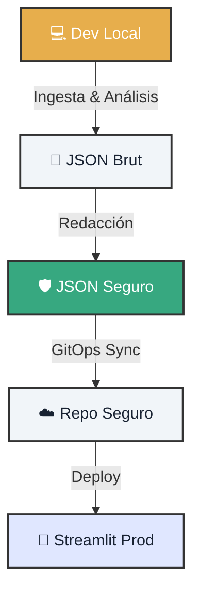

# 🧪 Laboratorio: GitOps & Streamlit UI

!!! info "Objetivo del Lab"
    Dominar el ciclo de vida completo: desde la ingesta local hasta la visualización en producción, asegurando que **ningún dato sensible se filtre** en el proceso.

---

<div class="tactical-container" style="margin: 4rem 0; padding: 2rem;">
  <h3 style="margin-top: 0; text-align: center; color: var(--atlantyqa-navy);">Arquitectura de Flujo de Datos</h3>
  

</div>

## 1. 🏁 Preparación

Asegúrate de tener el motor listo.

=== "🛠️ Prerrequisitos"
    *   **Python 3.10+**
    *   **Git** configurado
    *   (Opcional) Docker para aislamiento total

=== "⚡ Inicio Rápido"
    ```bash
    # Inicializa el entorno
    python cogctl.py init
    
    # Procesa un dato de prueba
    python cogctl.py ingest demo_input.json
    python cogctl.py analyze
    ```

---

## 2. 🎛️ Modos de Operación

Elige tu aventura: desarrollo local sin restricciones o simulación de producción blindada.

=== "💻 Modo Dev (Local)"
    En desarrollo, quieres ver todo para depurar.
    
    1.  **Ejecutar UI**:
        ```bash
        streamlit run frontend/streamlit_app.py --server.port 8501
        ```
    2.  **Verificación**: Abre `http://localhost:8501`. Deberías ver los datos en bruto.

=== "🛡️ Modo Prod (GitOps)"
    En producción, **la privacidad es no negociable**.
    
    1.  **Configurar Variables**:
        ```bash
        export COGNITIVE_ENV=prod
        export GITOPS_DATA_MODE=redacted
        export COGNITIVE_HASH_SALT=secreto_super_seguro
        ```
    2.  **Ejecutar Análisis Seguro**:
        ```bash
        python pipeline/analyze.py --input outputs/raw --output outputs/insights/analysis.json
        ```
    3.  **Sincronizar**:
        ```bash
        bash gitops/sync.sh
        ```
    
    > **Resultado:** Solo los datos ofuscados suben al repositorio.

---

## 3. 🔐 Seguridad y Auditoría

La confianza se basa en la evidencia. El sistema genera logs inmutables de cada acción.

??? check "Ver Ejemplo de Log de Auditoría"
    ```json
    {
      "timestamp": "2026-05-21T14:30:00Z",
      "event": "data_access",
      "user": "analyst_01",
      "resource": "analysis.json",
      "action": "read",
      "status": "allowed",
      "context": {
        "environment": "prod",
        "redaction_active": true
      }
    }
    ```

## 4. ✅ Checklist de Validación

Para completar este Lab, debes marcar todas las casillas:

<div class="feature-card" style="border-left: 4px solid var(--atlantyqa-green);">
    <ul style="list-style: none; padding-left: 0;">
        <li>✅ <strong>Ejecución Local:</strong> Ingesta y análisis completados sin errores.</li>
        <li>✅ <strong>Streamlit:</strong> Dashboard accesible en el puerto 8501.</li>
        <li>✅ <strong>Redacción:</strong> Confirmado que los nombres propios están enmascarados en Prod.</li>
        <li>✅ <strong>GitOps:</strong> El script de sincronización solo subió archivos seguros.</li>
        <li>✅ <strong>Auditoría:</strong> Existe evidencia en <code>outputs/audit/</code>.</li>
    </ul>
</div>

---

### ⚠️ Nota sobre Air-Gap
Para entornos de **máxima seguridad** (apagon de internet), asegúrate de replicar todas las dependencias y modelos en modo offline antes de cortar el acceso a la red.
