# 📊 Métricas de Impacto: Aprendizaje y Ecosistema

!!! quote "Filosofía de Medición"
    **No medimos para controlar, sino para aprender.** Buscamos capturar la velocidad de aprendizaje, la fiabilidad operativa y el crecimiento de la comunidad sin caer en métricas de vanidad.

---

  <h3 style="margin-top: 0; text-align: center; color: var(--atlantyqa-navy);">Ciclo de Valor Cognitivo</h3>
  

```mermaid
graph TD
    A[💡 Idea / Reto] --> B[💻 Ejecución Local]
    B --> C[🔄 PR & Review]
    C --> D[🚀 Merge & Deploy]
    D --> E[🎓 Lección Aprendida]

    style A fill:#e7ae4c,stroke:#333,stroke-width:2px,color:#fff
    style B fill:#37a880,stroke:#333,stroke-width:2px,color:#fff
    style C fill:#e0e7ff,stroke:#333,stroke-width:2px,color:#182232
    style D fill:#f1f5f9,stroke:#182232,stroke-width:2px,color:#182232
    style E fill:#ffffff,stroke:#182232,stroke-width:2px,stroke-dasharray: 5 5,color:#182232
```

## 1. 🎓 Métricas de Aprendizaje (Gamificación)

Instrumentamos **GitHub Projects** para que el aprendizaje sea visible y recompensado.

    

        <h3>🚀 TTFP (Time to First PR)</h3>
        
<strong>La Métrica Reina.</strong> Tiempo desde que un usuario dice "Hola" hasta que su primer PR es aceptado. Si baja, nuestro onboarding es de clase mundial.

    

    

        <h3>⚡ Learning Velocity</h3>
        
Número de issues `learning-task` completados por semana. Mide la salud y curiosidad de la cohorte activa.

    

### Sistema de Experiencia (XP)

Recompensamos el impacto real, no el tiempo en la silla.

| Nivel de Tarea | Recompensa (XP) | Ejemplo |
| :--- | :--- | :--- |
| **Nivel 1** | `10 XP` | Primer análisis, corrección simple |
| **Nivel 2** | `25 XP` | Nueva visualización, mejora de docs |
| **Nivel 3** | `50 XP` | Automatización CI/CD, nuevo modelo |
| **Nivel 4** | `100 XP` | Arquitectura, gobernanza, mentoring |

---

## 2. ⚙️ Métricas de Flujo & Fiabilidad

Para garantizar entregas sostenibles y prevenir el *burnout*.

    

        <h3>Cycle Time</h3>
        
Tiempo de <code>In Progress</code> a <code>Done</code>. Objetivo: Reducir bloqueos y esperas externas.

    

    

        <h3>CI Reliability</h3>
        
Porcentaje de builds verdes ('Success'). Un pipeline roto bloquea el aprendizaje.

    

    

        <h3>Sovereign Adoption</h3>
        
% de PRs que respetan el principio <strong>Local-First</strong>. Sin dependencias ocultas de la nube.

    

---

## 3. 🌍 Métricas de Ecosistema

Conectando el código con el impacto territorial.

*   ✅ **GitOps Coverage**: % de componentes con IaC y pipelines reproducibles.
*   ✅ **Territorial Impact**: Número de eventos comunitarios y estudiantes activos en regiones objetivo (ITI Andalucía, UE, LATAM).

---

## 4. 🛠️ Implementación Rápida (15 min)

Configura tu **GitHub Project v2** para empezar a medir hoy.

=== "1. Configurar Campos"
    Crea las siguientes columnas personalizadas:
    *   `Status`: Backlog, In Progress, Review, Done.
    *   `Area`: Learning, GitOps, Docs, Backend.
    *   `XP` (Number): Para sumar puntuaciones.
    *   `KPI` (Text): Etiquetas como "TTFP", "Reliability".

=== "2. Automatizar"
    *   Activa los workflows `add_to_project.yml`.
    *   Usa etiquetas para asignar XP automáticamente.

> **Recuerda:** Si se mide mal, se destruye la cultura. Medimos para mejorar el sistema, nunca para juzgar a las personas.
