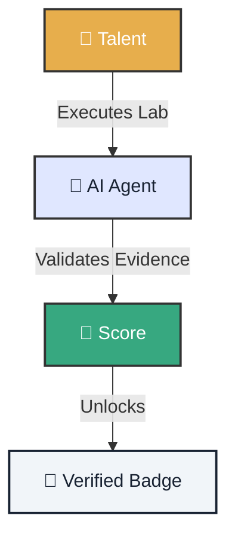

# 🏆 Talent Challenge Labs

!!! abstract "Training Ground"
    Prove your worth in real scenarios. These Labs aren't theoretical simulations; they're **operational missions** where your performance is measured with cryptographic evidence.

---

  <h3 style="margin-top: 0; text-align: center; color: var(--atlantyqa-navy);">Evaluation Ecosystem</h3>

## 1. 📂 Available Missions

Choose your difficulty level. Each completed mission forges your reputation in the community.

    

        <h3>🟢 Lab 01: Deep Dive</h3>
        
<strong>Objective:</strong> Configure the <em>Secure Pipeline</em>. Establish a baseline and run local analysis with active redaction.

        
<strong>Reward:</strong> <code>50 XP</code> + Badge 🛡️

        <a href="../lab-01-deep-dive/" class="btn-secondary" style="width:100%; text-align:center; margin-top:1rem;">Start Mission</a>
    

    

        <h3>🔵 Lab 02: GitOps Steward</h3>
        
<strong>Objective:</strong> Sync results to the cloud without leaking a single sensitive byte.

        
<strong>Reward:</strong> <code>100 XP</code> + Badge ☁️

        (Coming Soon)
    

    

        <h3>🔴 Lab 03: Runtime Guardian</h3>
        
<strong>Objective:</strong> Harden Docker containers and block attack vectors.

        
<strong>Reward:</strong> <code>200 XP</code> + Badge 💂

        (Experts Only)
    

---

## 2. 🤖 Your AI Copilot

You're not alone. A personal agent will accompany you during the challenge.

=== "🧭 Guide"
    Will explain the mission context and give you hints if you get stuck, without solving the problem for you.

=== "🛡️ Guardian"
    If you try to `git push` confidential data, the agent will block the action and explain the risk.

=== "⚖️ Judge"
    Will analyze your audit logs and `commit message` quality to calculate your final score.

---

## 3. 📜 Evaluation Rubric

Perfection isn't the goal, **consistency** is.

| Criterion | Weight | Description |
| :--- | :--- | :--- |
| **Correctness** | 40% | Does the code do what it should? |
| **Security** | 25% | Were redaction policies respected? |
| **Quality** | 20% | Code cleanliness, tests, and documentation. |
| **Collaboration** | 15% | Clarity in PR communication. |

> [!CAUTION]
> **Zero Tolerance for Fraud:** Any attempt to falsify audit logs will result in immediate and permanent disqualification.
